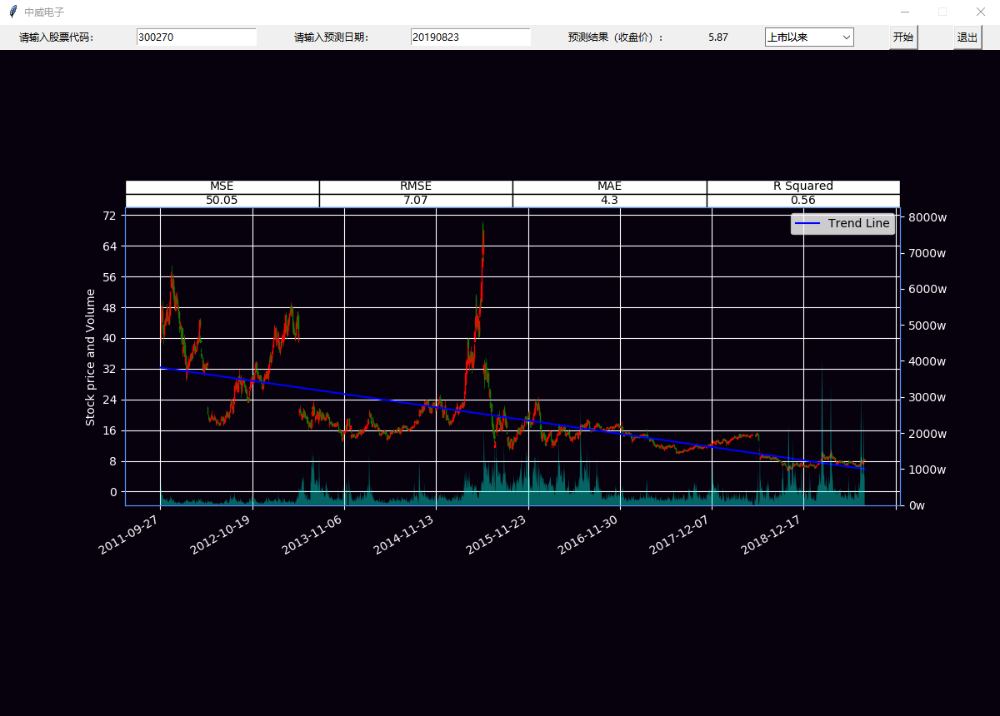
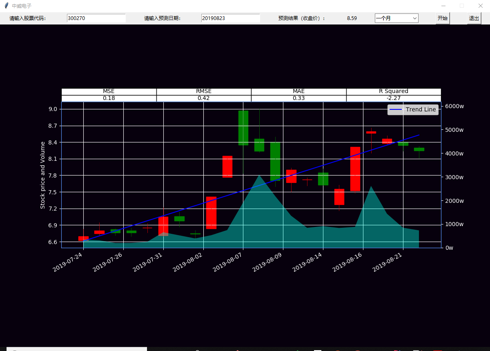

# 股票预测
可以作为学习使用，实际应用需谨慎

## ui方式
```
.\venv\Scripts\python stock.py
```


## console方式
如果是windows 可以直接双击run文件执行命令
```
.\venv\Scripts\python run.py
```

## search
查询股票代码
```
.\venv\Scripts\python search.py 300270
```

## data
获取股票数据
```
.\venv\Scripts\python data.py 300270
```

## analysis & predict
分析、预测股票数据(以收盘价计算)
```
.\venv\Scripts\python data.py 300270 20190909
```

